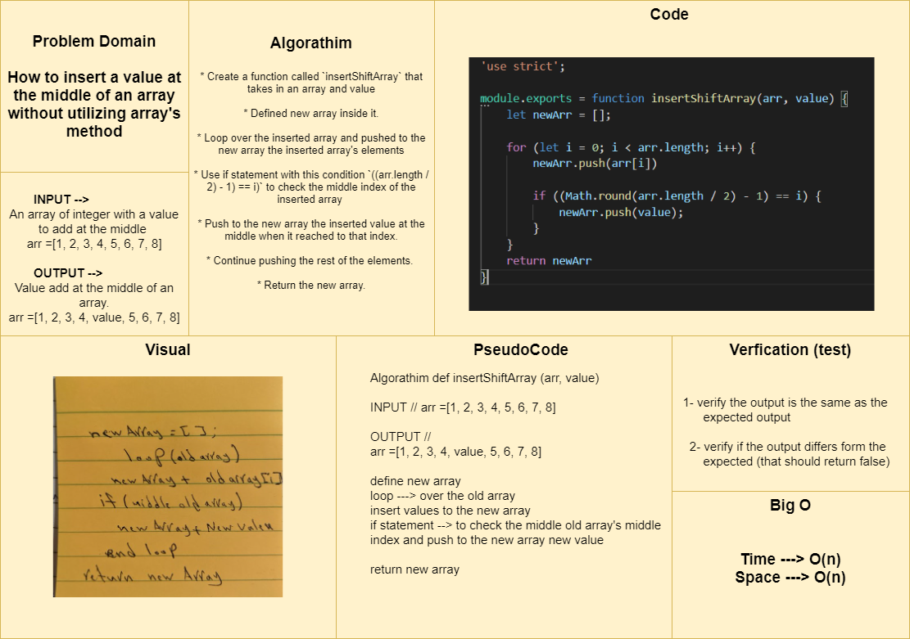

# Data Structures and Algorithms

See [setup instructions](https://codefellows.github.io/setup-guide/code-301/3-code-challenges), in the Code 301 Setup Guide.

----------------------------------------------------------------------------------

## 401 Table of contents:

|Code Challenge | Link |
|---------------|------|
|Reverse an Array| [Reverse an Array](javascript/code-challenges/arrayReverse/array-reverse.js) |
|Insert Shift Array| [Insert Shift Array](javascript/code-challenges/arrayShift/array-shift.js)   [Testing-Unit](code-challenges/array-shift-02.test.js)|

------------------------------------------------------------

# Documentations: 

### Reverse an Array
How to reverse an array without utilizing `Array.reverse()` method .

### Challenge
I have to write function that will reverse an array without using `Array.reverse()` method.

### Approach & Efficiency
- I created a function called `reverseArray` that take in an array as an argument, in the function I created a new empty array and I did a regular for loop to loop over the original array elements and I used `unshift` method to add each element to the beginning of the new array, finally returned the new array.

### Solution

-------------------------------------------------------------

# Insert Shift Array
How to insert a value at the middle of an array without utilizing array's method

## Challenge Description
I have to write a function that will insert a value at the middle of an array without using `array.unshift()` method

## Approach & Efficiency
I created function called `insertShiftArray` that takes in an array and value, then I defined new array inside it, loop over the inserted array and pushed to the new array the inserted array's elements and I used this algorithm to check the middle index of the inserted array `((arr.length / 2) - 1) == i)` in an if statement that will push to the new array the inserted value at the middle when it reached to that index, then continue pushing the rest of the elements. and return the new array.

## Solution

