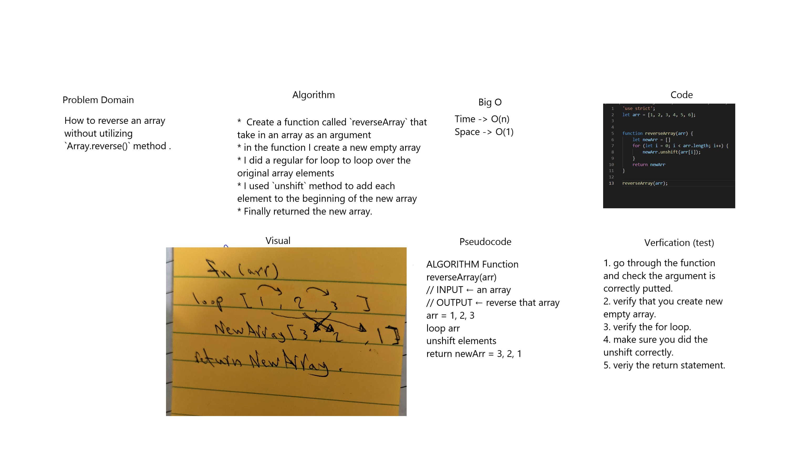

# Data Structures and Algorithms

See [setup instructions](https://codefellows.github.io/setup-guide/code-301/3-code-challenges), in the Code 301 Setup Guide.

----------------------------------------------------------------------------------

## 401 Table of contents:

|Code Challenge | Link |
|---------------|------|
|Reverse an Array| [Reverse an Array](javascript/code-challenges/arrayReverse/array-reverse.js) |

------------------------------------------------------------

# Documentations: 

### Reverse an Array
How to reverse an array without utilizing `Array.reverse()` method .

### Challenge
I have to write function that will reverse an array without using `Array.reverse()` method.

### Approach & Efficiency
- I created a function called `reverseArray` that take in an array as an argument, in the function I created a new empty array and I did a regular for loop to loop over the original array elements and I used `unshift` method to add each element to the beginning of the new array, finally returned the new array.

### Solution

-------------------------------------------------------------
