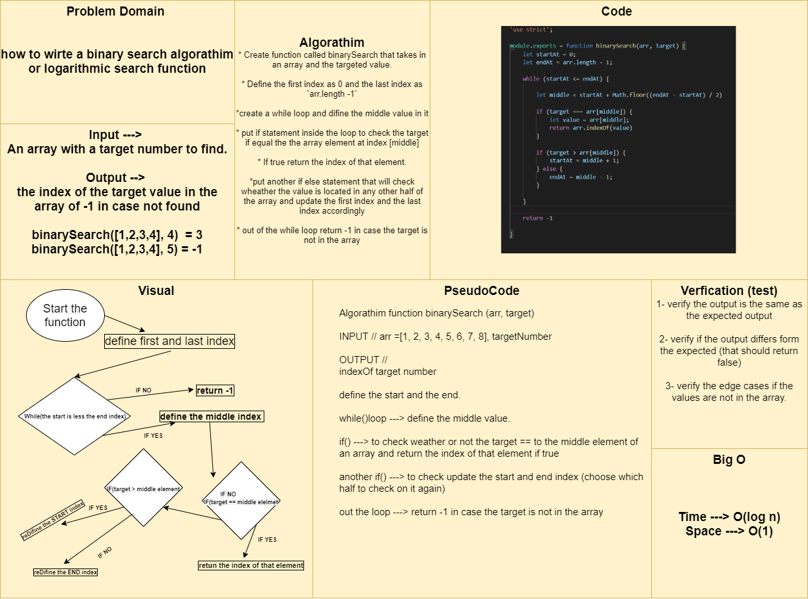

# Binary Search Algorithm
How to write binary search algorithm or logarithmic search function

### Challenge
I have to write function that will search in the sorted array for the targeted value in a binary way.

### Approach & Efficiency
- I created a function called binarySearch that takes in an array and the targeted value, then I defined the first index of this array as 0 and the last index using `array.length -1`, then I created a `while()` loop that has a condition as `the start index <= the last index` and I defined the middle index using `start index + Math.floor((end index - start index) / 2)`, then I put if statement with the condition `target === arr[middle]` to check if this is the targeted value and return the index for that value, after that I added another if else statement with a condition `target > arr[middle]` that if true will return `start index = middle + 1` and if false it will return `last index = middle - 1` and after the While loop I returned -1 in case the target is not in the array.

### Solution

