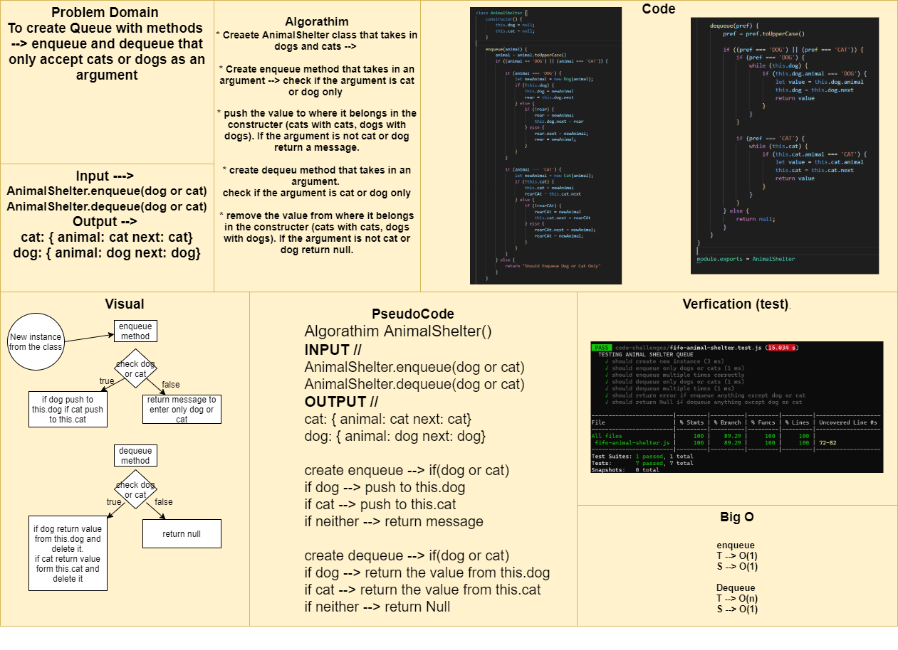

# Challenge Summary

To create Queue with methods `enqueue` and `dequeue` that only accept cats or dogs as an argument

## Approach & Efficiency

Big O

`enqueue` 
T --> O(1)
S --> O(1)

`dequeue` 
T --> O(n)
S --> O(1)

## Solution

Algorathim
* Creaete `AnimalShelter` class that takes in dogs and cats --> 

* Create enqueue method that takes in an argument --> check if the argument is cat or dog only 

* push the value to where it belongs in the constructer (cats with cats, dogs with dogs). If the argument is not cat or dog return a message.

* create dequeu method that takes in an argument. 
check if the argument is cat or dog only
 
* remove the value from where it belongs in the constructer (cats with cats, dogs with dogs). If the argument is not cat or dog return null.

[Code](./fifo-animal-shelter.js)

[Testing Unit](../../../code-challenges/fifo-animal-shelter.test.js)

## Whiteboard Process
