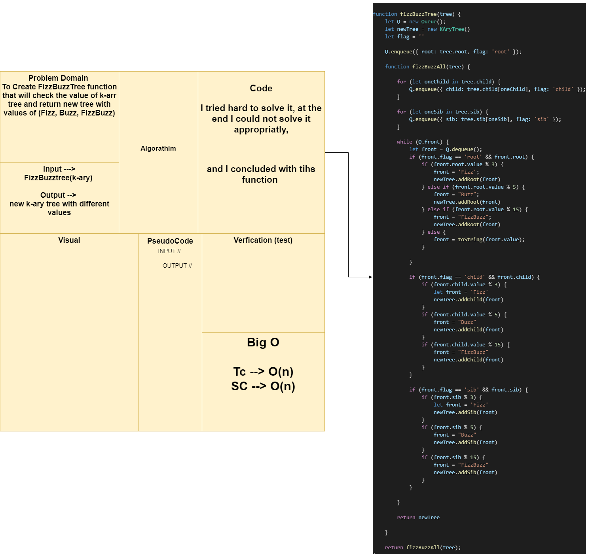

# FizzBuzz

# Challenge Summary
To write function that takes k-ary and return new k-ary with values if (Fizz, Buzz, FizzBuzz or string) 

## Approach & Efficiency
  TC --> O(n)
  SC --> O(n)

## Solution

## Whiteboard Process
