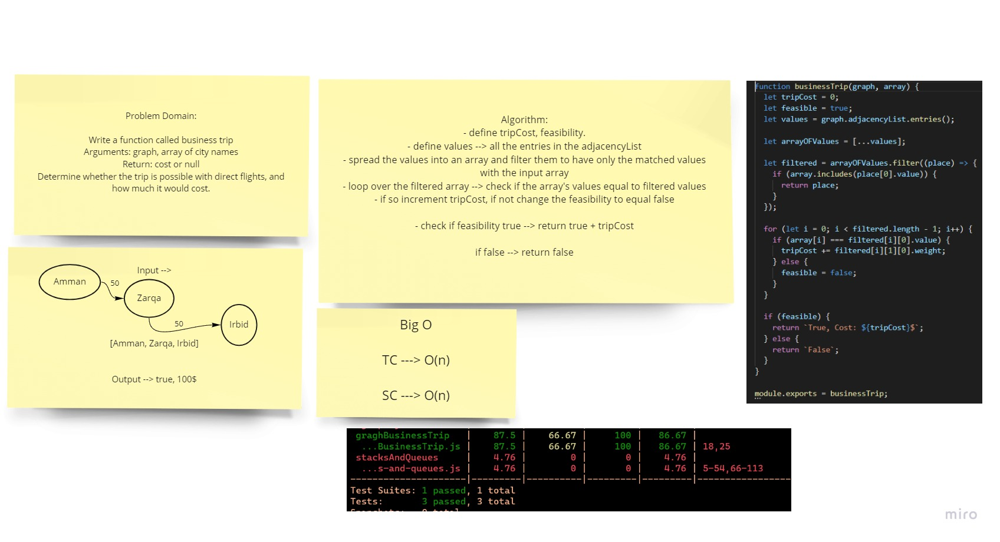

# Business Trip with Graph

Determine whether the trip is possible with direct flights, and how much it would cost.

## Challenge

Write a function called business trip
Arguments: graph, array of city names
Return: cost or null
Determine whether the trip is possible with direct flights, and how much it would cost.

## Approach & Efficiency

[Function](./graphBusinessTrip.js)

[Testing Unit](../../../code-challenges/graphBusinessTrip.test.js)

## WhiteBoard

