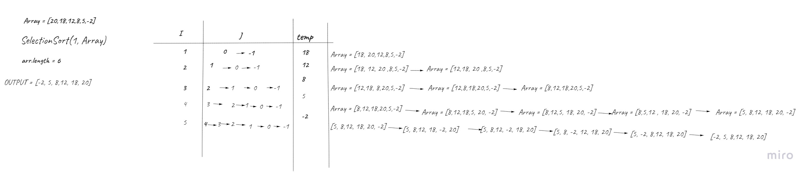
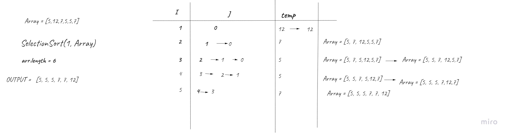
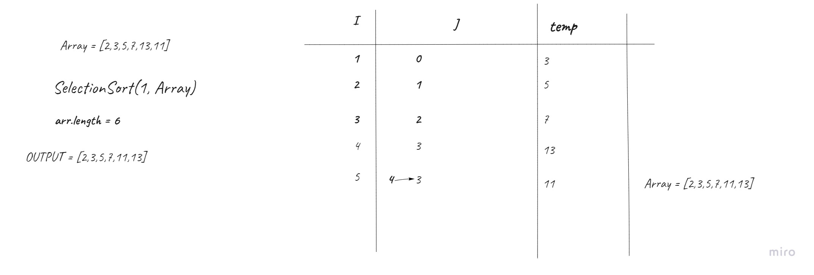
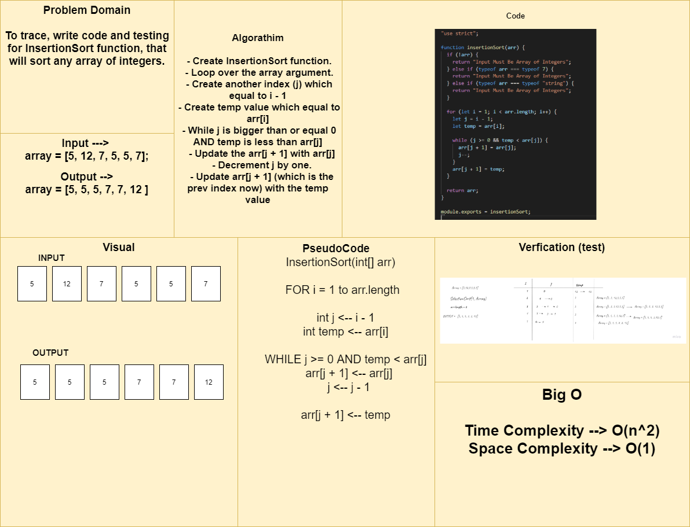

# Challenge Summary
To trace, write code and testing for InsertionSort function, that will sort any array of integers

## Approach & Efficiency
Big O
  - TC --> O(n^2)
  - SC --> O(1)

## Solution
 - Create InsertionSort function.
 - Loop over the array argument.
 - Create another index (j) which equal to i - 1
 - Create temp value which equal to arr[i]
 - While j is bigger than or equal 0 AND temp is less than arr[j]
   - Update the arr[j + 1] with arr[j]
   - Decrement j by one.
   - Update arr[j + 1] (which is the prev index now) with the temp value

## Tracing With different cases

## Whiteboard Process
