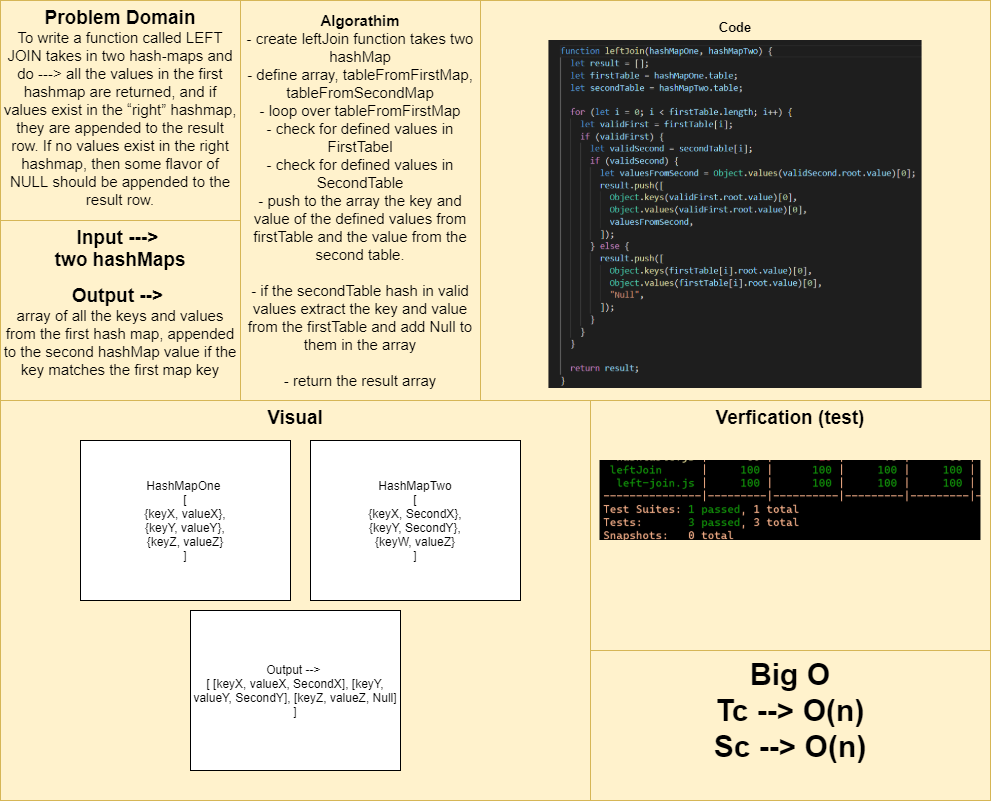

# Left-Join function with hashTables

## Challenge Summary

To write a function called LEFT JOIN takes in two hash-maps and do ---> all the values in the first hashmap are returned, and if values exist in the “right” hashmap, they are appended to the result row. If no values exist in the right hashmap, then some flavor of NULL should be appended to the result row.

## Approach & Efficiency

- create leftJoin function takes two hashMap
- define array, tableFromFirstMap, tableFromSecondMap
- loop over tableFromFirstMap
- check for defined values in FirstTabel
- check for defined values in SecondTable
- push to the array the key and value of the defined values from firstTable and the value from the second table.
- if the secondTable hash in valid values extract the key and value from the firstTable and add Null to them in the array
- return the result array

## Solution

[Function](./left-join.js)

[Testing Unit](../../../code-challenges/leftJoin.test.js)

## Whiteboard Process

