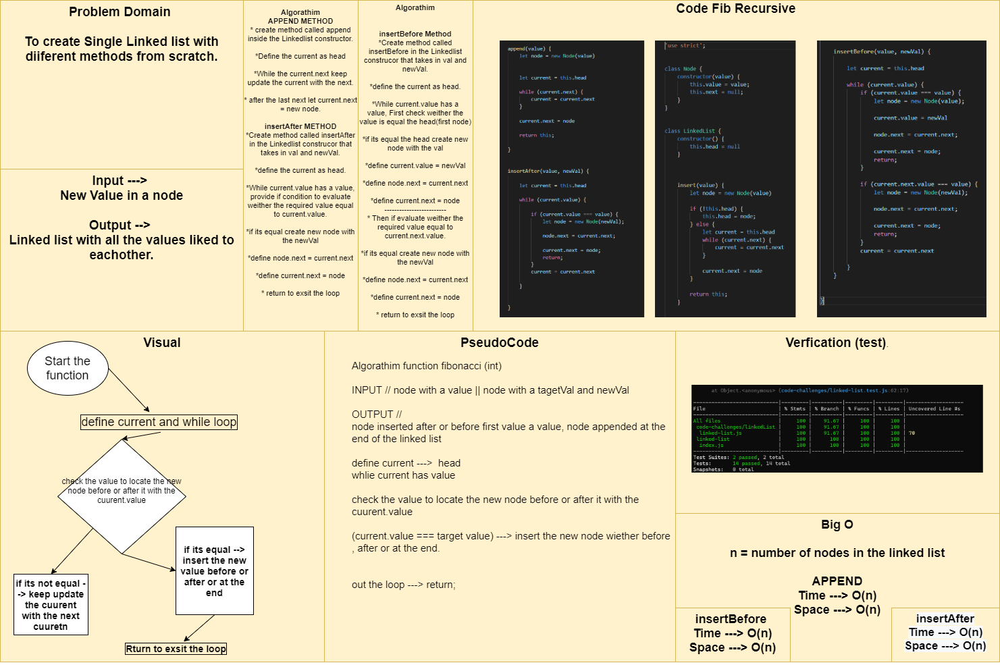

## Challenge
To create singly linked list form scratch with different methods and test those methods. and to make semantic (custom) error.

## Whiteboard Process

## Approach & Efficiency

- I created a class constructor called Node at the beginning that takes in a value as an argument and has next equal to null in it.
- I created another constructor class called LinkedList that has a head as null at the beginning.
- The LinkedList constructor has the following methods:
    - `insert()` : it has O(1) Time Complexity for inserting the head, and it allows you to insert new values at sequence in the linked list. (return the whole class to allow chaining insertion).
    
    - `includes()` : To evaluate wither the linked list has a certin value in it or not (returns a boolean).
    
    - `toString()` : return a string of the linked list values in format of "{ a } -> { b } -> { c } -> NULL".
    
    - `findPosition()` : return the position of the value you are looking for (for example head at position 1).

    - `append()` : append Value at the end of the linked list.

    - `insertBefore(val, newVal)` : insert the newVal before the value in the linked list.

    - `insertAfter(val, newVal)` : insert the newVal after the value in the linked list.

- I created custom Error by defining it as a class constructor that gives a customized message each time it will be thrown. 

### Links:

[Classes](javascript/code-challenges/linkedList/linked-list.js)

[Testing Unit](code-challenges/linked-list.test.js)

## Solution
<!-- Show how to run your code, and examples of it in action -->

## API
I created methodes inside this linked-list such as: 

- `includes()` : To evaluate wither the linked list has a certin value in it or not (returns a boolean).

- `insert()` : allow you to insert new values at the end of the linked list. (return the whole class to allow chaining insertion)

- `toString()` : return a string of the linked list values in format of "{ a } -> { b } -> { c } -> NULL"

- `findPosition()` : return the position of the value you are looking for (for example head at position 1).

- `append()` : append Value at the end of the linked list.

- `insertBefore(val, newVal)` : insert the newVal before the value in the linked list.

- `insertAfter(val, newVal)` : insert the newVal after the value in the linked list.
