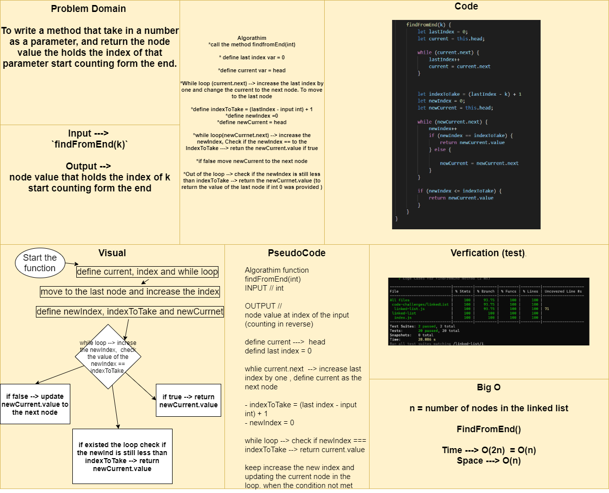

# Challenge Summary
To write method that take in a number as a parameter, and return the value of the node that has the same index number start counting from last index.

## Approach & Efficiency
`findFromEnd(k)` ---> takes in a number then loop to the last node in the LinkedList then write a math equation that will callcolute the index of the node to take its value based of the k number `let indexToTake = (lastIndex - k) + 1` and define another index=0, start while loop again and make a condition to check weather the k inserted == to the indexToTake that return the node value when its true. 

## Solution

- call the function `findFromEnd(k)` with a number
- it will return to you the node value that meet the number you entered start counting form the last node of the linked list.

## Whiteboard Process

