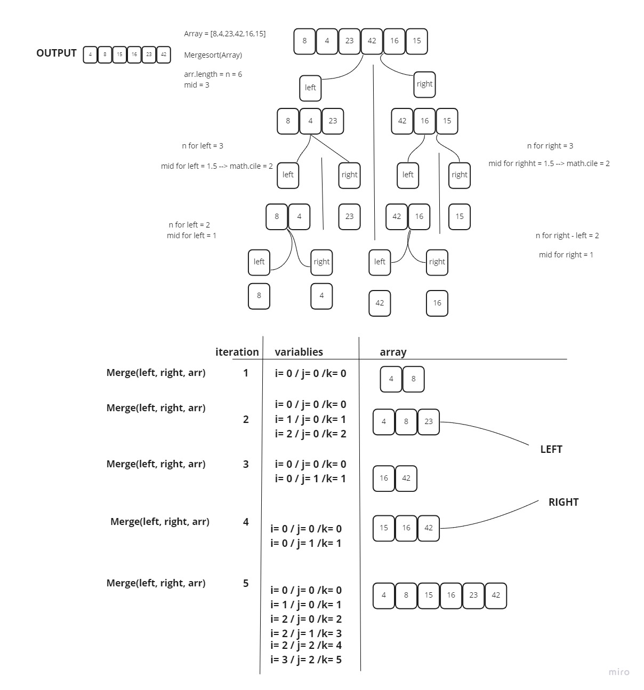

# MergeSort Function

## Problem Domain
 To create two functions that will split an array to left and right arrays and sort them from lowest to highest recursively.

## Efficacy
   TC  ---> O(n) 
    
   SC ---> O(mid) mid = n/2 

## Links
[Function](./mergeSort.js)
 
[Testing Unit](../../../code-challenges/mergeSort.test.js)

## Tracing 

