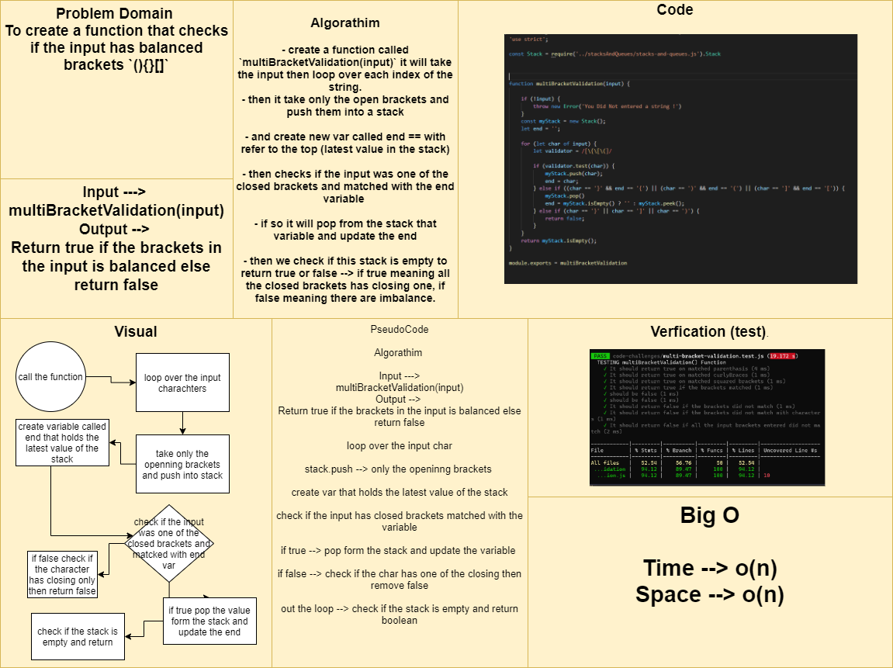

# Brackets Stack

## Challenge Summary
To create a function that checks if the input has balanced brackets `(){}[]`

## Approach & Efficiency
- create a function called `multiBracketValidation(input)` it will take the input then loop over each index of the string.
- then it take only the open brackets and push them into a stack
- and create new var called end == with refer to the top (latest value in the stack)
- then checks if the input was one of the closed brackets and matched with the end variable 
- if so it will pop from the stack that variable and update the end
- then we check if this stack is empty to return true or false --> if true meaning all the closed brackets has closing one, if false meaning there are imbalance.

## Solution
call this function with string input as an argument `multiBracketValidation(input)`.
it will return `true` if the brackets are balanced and `false` if they are not.

[Function](./multi-bracket-validation.js)

[Testing Unit](../../../code-challenges/multi-bracket-validation.test.js)

## Whiteboard Process

