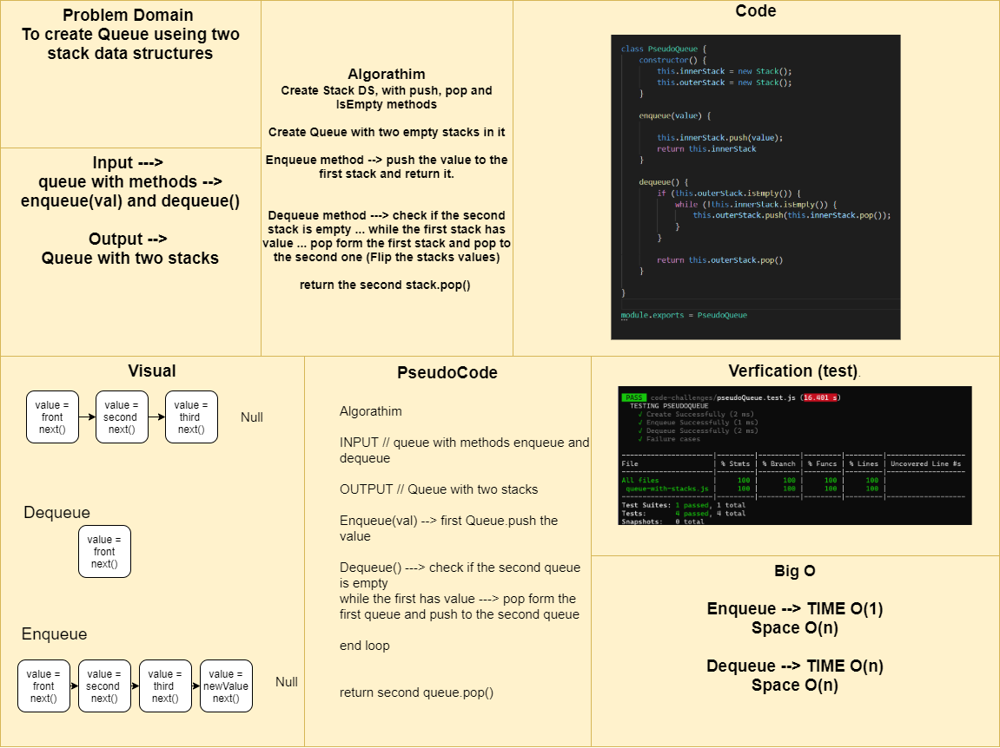

# Queue with two stacks

## Challenge Summary
To write Queue with two stacks.

## Approach & Efficiency
Create Stack DS, with push, pop and IsEmpty methods
Create Queue with two empty stacks in it
Enqueue method --> push the value to the first stack and return it.
Dequeue method ---> check if the second stack is empty ... while the first stack has value ... pop form the first stack and pop to the second one (Flip the stacks values)
return the second stack.pop()

## Solution
make new instance form `PseudoQueue` class.

`enqueue(val)`---> it will add to the end of the queue.

`dequeue()` ---> it will return the first value were enqueued (FIFO).

[Queue Class](./queue-with-stacks.js)

[Testing Unit](../../../code-challenges/pseudoQueue.test.js)

## Whiteboard Process
