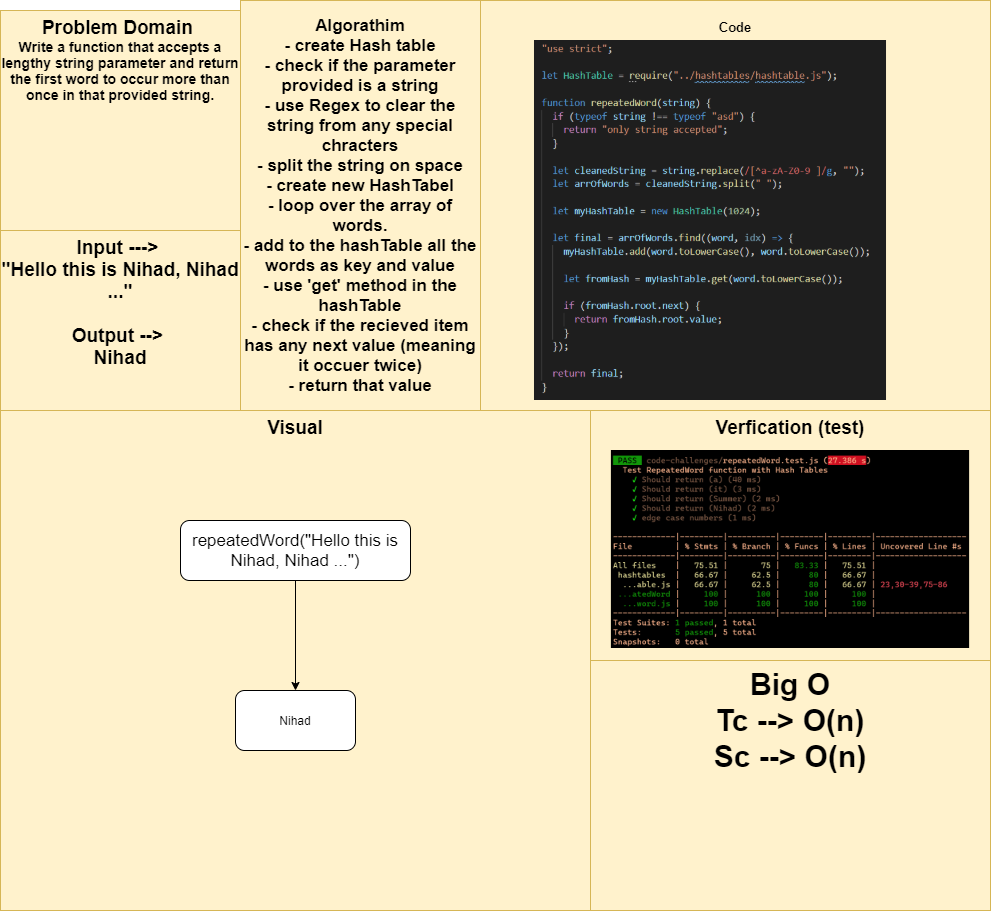

# RepeatedWord function using HashMaps

## Challenge Summary

To create a function that takes in string and return the first word to occur more than once in that provided string.

## Approach & Efficiency
- create Hash table
- check if the parameter provided is a string
- use Regex to clear the string from any special chracters
- split the string on space
- create new HashTabel
- loop over the array of words.
- add to the hashTable all the words as key and value
- use 'get' method in the hashTable
- check if the recieved item has any next value (meaning it occuer twice)
- return that value

## Solution

[Function](./repeated-word.js)

[Testing Unit](../../../code-challenges/repeatedWord.test.js)

## Whiteboard Process

