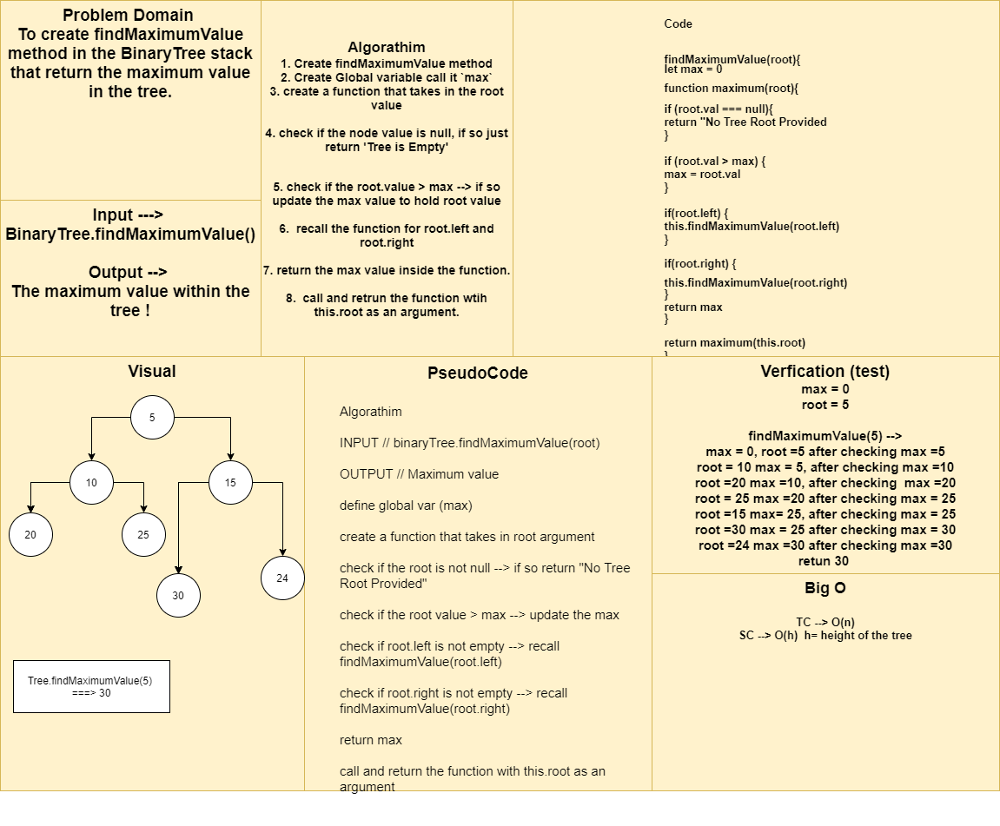

# Challenge Summary
To create findMaximumValue method in the BinaryTree stack that return the maximum value in the tree.

## Approach & Efficiency
  1. Create findMaximumValue method
  2. Create Global variable call it `max`
  3. create a function that takes in the root value
  4. check if the node value is null, if so just return 'Tree is Empty'  
  5. check if the root.value > max --> if so update the max value to hold root value
  6.  recall the function for root.left and root.right
  7. return the max value inside the function.
  8.  call and return the function with this.root as an argument.

  TC --> O(n)
  SC --> O(h)

## Solution
  1. create binaryTree and attach to it nodes. 
  2. binaryTree.findMaximumValue().
  3. it will return the max value in the tree.

## Whiteboard Process
