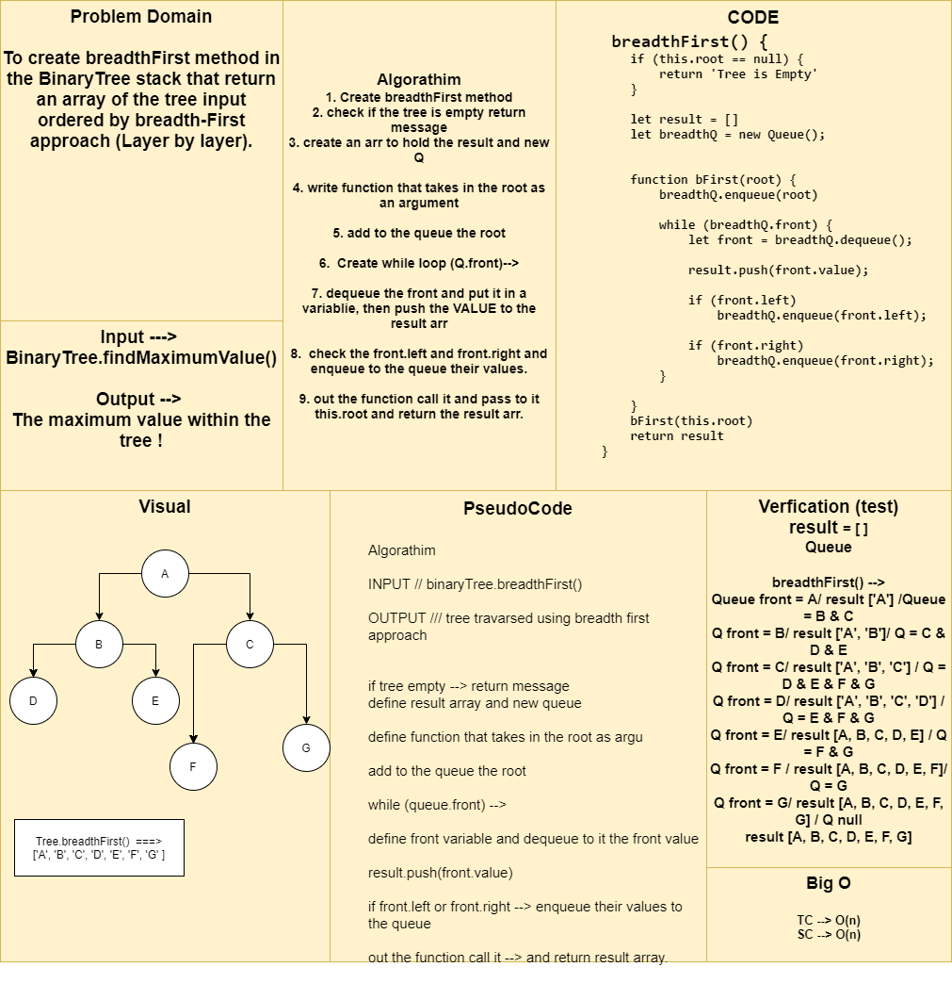

# Breadth First Traversal for Binary Tree 

## Challenge Summary
To create breadthFirst method in the BinaryTree stack that return an array of the tree input ordered by breadth-First approach (Layer by layer).

## Approach & Efficiency
1. Create breadthFirst method
2. check if the tree is empty return message
3. create an arr to hold the result and new Q
4. write function that takes in the root as an argument
5. add to the queue the root
6.  Create while loop (Q.front)-->
7. dequeue the front and put it in a variable, then push the VALUE to the result arr
8.  check the front.left and front.right and enqueue to the queue their values.
9. out the function call it and pass to it this.root and return the result arr.

  TC --> O(n)
  SC --> O(n)

## Solution
  1. create binaryTree and attach to it nodes. 
  2. binaryTree.breadthFirst().
  3. it will return array of the tree values ordered by breadthFirst approach.

## Whiteboard Process
