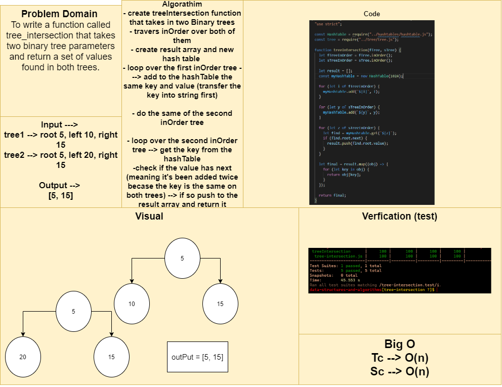

# Tree intersection function with hashTables

## Challenge Summary

To write a function called tree_intersection that takes two binary tree parameters and return a set of values found in both trees.

## Approach & Efficiency

- create treeIntersection function that takes in two Binary trees.
- traverse inOrder over both of them.
- create result array and new hash table.
- loop over the first inOrder tree ---> add to the hashTable the same key and value (transfer the key into string first).
- do the same of the second inOrder tree.
- loop over the second inOrder tree --> get the key from the hashTable.
- check if the value has next (meaning it's been added twice becase the key is the same on both trees) --> if so push to the result array and return it.

## Solution

[Function](./tree-intersection.js)

[Testing Unit](../../../code-challenges/tree-intersection.test.js)

## Whiteboard Process

